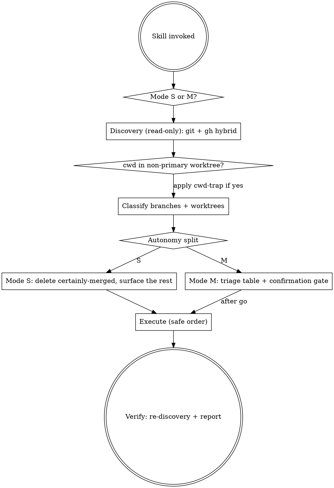

# Cleanup branches & worktrees

Analyze and clean up local git state: worktrees, local branches, and upstream tracking. Universal — works on any repo; do **not** hardcode names. Scope is **git only** — this skill never edits working-tree files and never touches remote branches.

The novelty over a plain "remove orphans" pass is twofold: it classifies **every** local branch and worktree (not just orphans), and it runs in two modes that differ only in *entry point* and *autonomy*.

## Modes

| | **Mode S — session / post-merge** | **Mode M — manual audit** |
|---|---|---|
| **Trigger** | handed off after merge (from `hcb-github:github-pr-workflow` step 6/7, a `/batch` run) or contextually — «приберись после merge», «прибери перед выходом» | explicit — «почисти ветки / worktree», «what branches can I delete», «проанализируй worktree» |
| **Scope** | branches / worktrees of *this session's* merged work | the whole repo |
| **Autonomy** | deletes what is **certainly merged** with no confirmation; surfaces everything else | triage table + one confirmation gate for everything |

`cwd` inside a non-primary worktree is **not** a third mode — it is an orthogonal safety mechanic (the cwd trap) that applies in both modes when removing the worktree you are standing in. See [Removing the current worktree](#removing-the-current-worktree-cwd-trap).

## Flow



## Phase 1 — Discovery (read-only)

Gather state in one parallel batch:

```bash
git -C <repo> worktree list --porcelain            # active worktrees (first 'worktree' line = primary)
git -C <repo> branch -vv                            # local branches + upstream; ": gone]" = remote deleted
git -C <repo> for-each-ref --format='%(refname:short) %(upstream:track) %(committerdate:relative)' refs/heads
git -C <repo> status -b --porcelain=v2 | head -5    # current branch + upstream
git -C <repo> rev-parse --show-toplevel             # root of the worktree containing cwd
ls -la <repo>/.claude/worktrees/ 2>/dev/null        # Claude Code worktree dir; may be absent — ignore if so
```

Determine the **primary worktree** (first row of `git worktree list`) and the **main branch** (`git symbolic-ref refs/remotes/origin/HEAD --short` → e.g. `origin/dev` → `dev`; never assume `main`/`master`/`dev`).

**gh hybrid (GitHub repos only).** `git branch --merged` does **not** list squash-merged branches — they look unmerged. When the repo is on GitHub and `gh` is available and authed, read PR state to close that gap:

```bash
gh repo view --json nameWithOwner -q .nameWithOwner 2>/dev/null   # GitHub repo + gh ready? empty ⇒ skip gh
gh pr list --state merged --json headRefName,number --limit 200 2>/dev/null   # merged PRs → head branches
gh pr list --state open   --json headRefName,number --limit 200 2>/dev/null   # open PRs → branches to KEEP
```

If `gh` is absent, unauthed, offline, or the repo is not on GitHub → fall back to git-only. Mark squash-merged as **undetectable** and never auto-delete a branch whose merge status is unknown (see [Safety invariants](#safety-invariants)).

## Phase 2 — Classification

Classify every local branch and worktree. These tables drive both modes; the mode only decides what happens to each row.

### Branches

| Signal | Category | Action |
|---|---|---|
| in `git branch --merged <main>` | merged | delete |
| `gh` PR state = MERGED (but not git-merged) | squash-merged | delete (*only gh knows*) |
| `: gone]` upstream + merged | orphan, merged | delete |
| `: gone]` upstream + **not** merged | orphan, unmerged | **skip** — warn, may hold unmerged work |
| `gh` PR state = OPEN | in flight | keep |
| no upstream, no PR, `0` unique commits vs `<main>` | stale local-only | candidate — surface |
| no upstream, no PR, `>0` unique commits | local work | keep — surface |
| current branch, upstream `: gone]` | broken tracking | `--set-upstream-to=origin/<main>` |
| primary / `<main>` | — | **never touch** |

"Unique commits vs `<main>`" = `git rev-list --count <main>..<branch>`; `0` means nothing would be lost.

### Worktrees

| Signal | Category | Action |
|---|---|---|
| locked (stale agent worktree) | locked | unlock + `remove --force` |
| clean + branch merged | done | `remove` |
| uncommitted changes | dirty | **skip** — surface |
| dir exists, absent from `worktree list` | filesystem orphan | `rm -rf` + `prune` |
| non-primary, branch has open PR | in flight | keep |
| primary | — | **never touch** |

## Phase 3 — Decision

### Mode S — autonomous post-merge

For each classified item:

- **Certainly merged** — git-merged (`git branch --merged <main>`) **or** `gh` reports its PR `MERGED`. → Delete **autonomously, no confirmation**.
- **Everything else** — unmerged, dirty, open-PR, local-only with unique work, **or** merge status unknown (squash-merge + no `gh`). → Do **not** auto-delete. Collect into a surfaced list, present it after the autonomous pass, let the user decide.

Autonomous is not silent: Phase 5 reports every item deleted without asking.

### Mode M — manual audit

Build the full triage table (both tables above, whole repo), each row tagged with its suggested action. Present it. Then **one** confirmation gate:

> «Все? Только эти: X, Y?»

Wait for explicit go-ahead. "all" / «поехали» → proceed; a subset → process only that. Never delete unprompted in Mode M.

## Phase 4 — Execute

For each approved/autonomous action, in this order:

```bash
# 1. Worktrees (unlock if locked, then remove)
git -C <repo> worktree unlock <path>            # silently no-ops if not locked
git -C <repo> worktree remove --force <path>    # --force only for confirmed dirty-but-intended

# 2. Filesystem orphans (dirs left by crashed agents / rm-then-prune races)
rm -rf <orphan-dir>

# 3. Prune stale worktree registry entries
git -C <repo> worktree prune --verbose

# 4. Local branches (merged / squash-merged only)
git -C <repo> branch -D <branch>

# 5. Fix broken tracking on the current branch
git -C <repo> branch --set-upstream-to=origin/<main> <current-branch>
```

## Phase 5 — Verify

Re-run discovery; report the diff. In Mode S, **explicitly list what was auto-deleted** — autonomy does not excuse silence.

```
✅ Removed N worktrees, M orphan dirs, K branches; fixed tracking on <current>.
   (Mode S — auto-deleted because merged: <branch-a>, <worktree-b>)
   (Surfaced, awaiting your call: <branch-c> — unmerged)

$ git worktree list
<primary only>

$ git branch
* <current>
  (any kept-on-purpose)
```

## Removing the current worktree (cwd trap)

`git worktree remove` checks the process's real working directory, so `git -C <primary> worktree remove <current>` still fails while cwd is inside the target. To remove the worktree you are standing in, physically leave first:

```bash
cd <primary-worktree>                                  # separate Bash call — genuinely must change cwd
git -C <primary-worktree> worktree remove <current>    # --force only if confirmed dirty-but-intended
git -C <primary-worktree> branch -D <branch>           # only if certainly merged
git -C <primary-worktree> worktree prune --verbose
```

After this, cwd has moved — subsequent commands run from the primary worktree (the old path no longer exists). Tell the user cwd moved to `<primary-worktree>`.

## Safety invariants

Hold on every path, in both modes:

| ❌ Never | ✅ Always |
|---|---|
| touch the primary worktree or `<main>` | use `gh` read-only (status queries) — never `gh pr merge/close/edit` |
| push or delete a **remote** branch (shared state — separate ask) | when merge status is unknown, surface — never auto-delete |
| `--force` a worktree with uncommitted changes without asking | skip a dirty worktree and surface it |
| auto-delete a **non**-merged branch (even in Mode S) | report Mode S deletions explicitly in Phase 5 |
| `git reset --hard` (out of scope) | verify a branch is merged into `<main>` before deleting |

## Edge cases

- **Squash-merged + no `gh`**: merge status is genuinely unknown — surface, never auto-delete. This is the main reason Mode S is conservative without `gh`.
- **`gh` rate-limited / offline mid-run**: degrade to git-only for the rest of the pass; downgrade any gh-dependent "certainly merged" to "surface".
- **Worktree path missing on disk but still in `worktree list`**: `git worktree prune` cleans this — run it before `worktree remove`.
- **`origin/HEAD` not set**: fall back to asking which branch is main, or pick the only remote-tracking branch.
- **Detached-HEAD worktree** (no branch): classify by clean/dirty only; never try to delete a branch for it.
- **Submodule worktrees**: skip — leave them alone.
- **`.claude/worktrees/` dir with no matching `worktree list` entry**: remove the orphan filesystem dir only; never touch `.git/` internals.
- **Branch `--force-with-lease` collision** (user pushed elsewhere): out of scope, surface to the user.
