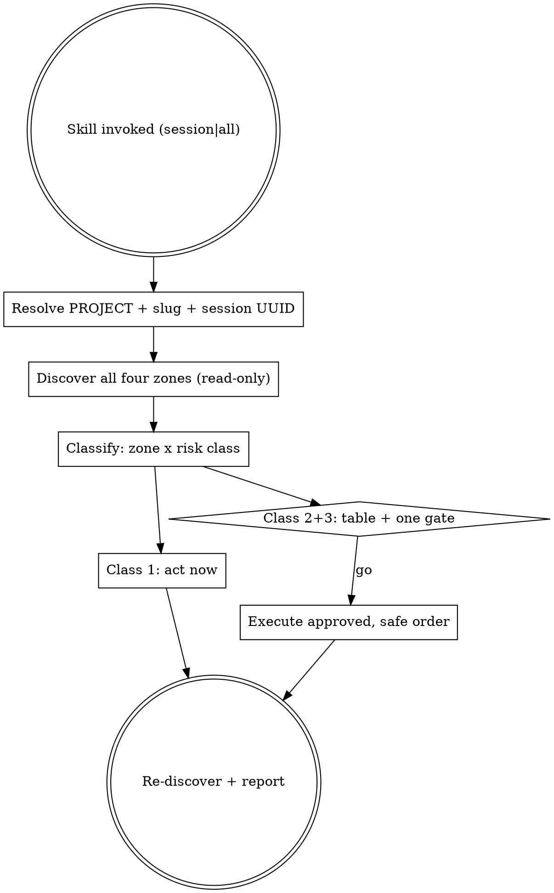

# Cleanup project

Work leaves residue in four places at once. Git holds dead branches and stale
worktrees; the working tree collects scratch scripts and logs; `~/.claude/`
accumulates conversation logs; `/tmp` accumulates scratchpads. This skill sweeps
all four — **for one project only**.

## The one rule — the scope is this project, and it never widens

Establish the boundary before touching anything:

```bash
git rev-parse --show-toplevel        # the worktree containing cwd
git worktree list --porcelain        # first entry = primary worktree = PROJECT
```

`PROJECT` is the **primary worktree path** — not cwd. Running from inside a
worktree still means cleaning the project as a whole.

Everything cleaned must belong to `PROJECT`. Junk from a neighbouring project is
out of scope no matter how obvious it is — mention it in one line at the end and
leave it alone. Never walk `~/projects`, `~/.claude/projects` or `/tmp` looking
for work beyond this project.

### Deriving this project's slug

Claude Code encodes an absolute path into a directory name by replacing every
`/` and every `.` with `-`:

```bash
slug() { printf '%s\n' "$1" | sed 's/[/.]/-/g'; }
# /Users/x/proj                        -> -Users-x-proj
# /Users/x/proj/.claude/worktrees/foo  -> -Users-x-proj--claude-worktrees-foo
# /Users/x/plex.sokolov.me             -> -Users-x-plex-sokolov-me
```

**A prefix glob `<slug>*` is not a membership test.** `-Users-x-proj*` also
matches `-Users-x-proj-other`, a different project entirely. A directory belongs
to `PROJECT` only if the remainder after the slug is **empty** or starts with
`--claude-worktrees-` / `--worktrees-`. When a name is still ambiguous, settle it
with the fact recorded in the log itself:

```bash
grep -m1 -o '"cwd":"[^"]*"' <dir>/<session>.jsonl
```

### Anchoring the current session

The scratchpad path in the system prompt is
`/tmp/claude-<uid>/<slug>/<session-uuid>/scratchpad`. It yields both the project
slug and this session's UUID — that UUID names the live conversation log,
`~/.claude/projects/<slug>/<session-uuid>.jsonl`. Session start, for mode S:

```bash
head -1 ~/.claude/projects/<slug>/<uuid>.jsonl | grep -o '"timestamp":"[^"]*"'
# then: find <PROJECT> -newermt "<that timestamp>" -type f -not -path '*/.git/*'
```

## The four zones

| Zone | Where | What accumulates |
|---|---|---|
| **Git** | `PROJECT` | merged branches, stale/locked/`prunable` worktrees, `: gone]` upstreams |
| **Working tree** | `PROJECT` | untracked scratch scripts, `*.log`, `*.orig`/`*.rej`, `.DS_Store`, dumps |
| **Conversations** | `~/.claude/projects/<slug>[--claude-worktrees-*]/` | `*.jsonl` logs, `<uuid>/tool-results/` payloads |
| **Scratchpads** | `/tmp/claude-$(id -u)/<slug>[--claude-worktrees-*]/<uuid>/` | per-session temp files, wholly derived data |

## The two modes

The argument picks the mode. With no argument, ask which one — do not guess.

| | **S — `session`** | **A — `all`** |
|---|---|---|
| Question it answers | "what did *this* session leave behind?" | "what has this project accumulated, ever?" |
| Filter | created/modified after session start | no age filter |
| Typical use | before closing a session | periodic audit |
| Current session's own log & scratchpad | still live — **never removed**, see below | same |

Mode changes *what is listed*. It does **not** change how freely things are
deleted — that is the risk class below.

## Risk classes — reversibility decides the gate, not the mode

| Class | Items | Gate |
|---|---|---|
| **1 — no data loss** | `git worktree prune` of `prunable` entries; `tool-results/` dirs whose `<uuid>.jsonl` is gone; scratchpads of finished sessions | act, then report |
| **2 — recoverable** | delete a branch whose commits are in `<main>`; remove a *clean* worktree of a merged branch; repair a `: gone]` upstream | inside the confirmed plan |
| **3 — irreversible** | unmerged branch; dirty worktree; any working-tree file; any `*.jsonl` | explicit confirmation, always |

Class 3 is never done on inference. A `*.jsonl` deletion ends `--resume` and
history search for that conversation forever — say so when proposing it.

## Flow



## Phase 1 — Discovery (read-only, one parallel batch)

```bash
# Zone: git
git -C $PROJECT worktree list                      # 'prunable' = dir gone, entry left
git -C $PROJECT branch -vv                         # ': gone]' = upstream deleted
git -C $PROJECT symbolic-ref refs/remotes/origin/HEAD --short   # -> origin/<main>
git -C $PROJECT branch --merged <main>
git -C $PROJECT status --porcelain -unormal        # zone: working tree

# Zone: conversations / scratchpads — membership-filtered, never a bare glob
ls -d ~/.claude/projects/<slug> ~/.claude/projects/<slug>--claude-worktrees-* 2>/dev/null
du -sh <each>                                      # size is what makes this worth doing
ls -d /tmp/claude-$(id -u)/<slug>* 2>/dev/null     # then apply the membership test
```

Never assume `main`/`master`/`dev` — read `origin/HEAD`. If it is unset, ask.

**Squash-merged branches look unmerged to git.** When the repo is on GitHub and
`gh` is authed, close that gap read-only:

```bash
gh pr list --state merged --json headRefName --limit 200   # -> safe to delete
gh pr list --state open   --json headRefName --limit 200   # -> keep, in flight
```

Without `gh`, a branch that is not in `--merged <main>` has **unknown** merge
status: surface it, never delete it.

## Phase 2 — Classification

**Branches**

| Signal | Verdict |
|---|---|
| in `branch --merged <main>` | delete (class 2) |
| `gh` says its PR is `MERGED` | delete (class 2) — only `gh` knows this |
| `: gone]` upstream **and** merged | delete (class 2) |
| `: gone]` upstream, **not** merged | surface (class 3) — may hold the only copy |
| `gh` says its PR is `OPEN` | keep |
| no upstream, `rev-list --count <main>..<b>` = 0 | delete (class 2) — nothing to lose |
| no upstream, unique commits | surface (class 3) |
| `<main>` or the current branch | never delete |

**Worktrees**

| Signal | Verdict |
|---|---|
| `prunable` | `worktree prune` (class 1) |
| locked, branch merged | `worktree unlock` + `remove` (class 2) |
| clean, branch merged | `remove` (class 2) |
| uncommitted changes | surface (class 3) — never `--force` unasked |
| branch has an open PR | keep |
| primary worktree | never touch |

**Conversations** — this project's slugs only.

| Signal | Verdict |
|---|---|
| slug dir of a worktree that no longer exists on disk | propose deletion (class 3) — the work it describes is gone |
| `<uuid>/tool-results/` with no matching `<uuid>.jsonl` | delete (class 1) — orphaned payload |
| `<uuid>.jsonl` of the **current session** | never touch |
| every other `*.jsonl` | report size/age/count; delete only on an explicit request |

Do not propose a blanket "everything older than N days" sweep unless asked for
one. Old logs of a live project are the searchable history.

**Scratchpads** — wholly derived; the least dangerous zone.

| Signal | Verdict |
|---|---|
| `<uuid>/` of a finished session | `rm -rf` (class 1) |
| `<uuid>/` of the **current session** | keep — it is in use; say it dies with the session |

## Phase 3 — The gate

Present one table: zone, item, size or age, verdict, risk class. Then ask once,
in Russian, naming what is irreversible:

> Класс 1 уже сделал. Удаляю: ветки X, Y; worktree Z; логи мёртвого worktree W
> (это необратимо — `--resume` по ним больше не поднять). Всё? Или подмножество?

Wait for an explicit answer. A subset means only that subset.

## Phase 4 — Execute (this order)

```bash
git -C $PROJECT worktree prune --verbose                  # 1. reconcile registry first
git -C $PROJECT worktree unlock <path>                    # 2. no-op if not locked
git -C $PROJECT worktree remove <path>                    #    --force only if confirmed dirty
rm -rf <orphan-worktree-dir>                              # 3. dirs left by crashed agents
git -C $PROJECT branch -D <branch>                        # 4. after its worktree is gone
git -C $PROJECT branch --set-upstream-to=origin/<main> <current>   # 5. repair tracking
rm -rf /tmp/claude-$(id -u)/<slug>/<finished-uuid>        # 6. scratchpads
rm -rf ~/.claude/projects/<dead-worktree-slug>            # 7. logs — approved items only
```

Branch deletion fails while a worktree still has it checked out — hence the
order. To remove the worktree **you are standing in**, physically leave first
(`git worktree remove` inspects the real cwd):

```bash
cd <PROJECT>                                   # a separate Bash call — cwd must truly change
git -C <PROJECT> worktree remove <old-cwd>
```

Then tell the user cwd moved to `PROJECT` — their old path no longer exists.

## Phase 5 — Verify and report

Re-run discovery. Report per zone: what went, what was kept and why, how much
disk came back (`du -sh` before/after on the two `~/.claude` + `/tmp` zones —
that number is usually the point). List class-1 actions taken without asking.
Close with anything surfaced and left for the user to decide.

## Never

| ❌ | ✅ |
|---|---|
| touch another project's repo, logs or scratchpads | stay inside `PROJECT`, mention neighbours in one line |
| match slug dirs with a bare `<slug>*` glob | require empty or `--claude-worktrees-` remainder; verify via `"cwd"` |
| delete the current session's `.jsonl` or scratchpad | let them expire on their own |
| delete an unmerged branch, or one whose status is unknown | surface it and let the user decide |
| `--force` a dirty worktree unasked | skip it, report it |
| push or delete a **remote** branch | keep `gh` read-only — never `pr merge/close/edit` |
| `git reset --hard`, stage, commit, or edit code | git plumbing and file removal only |
| assume `main`/`master`/`dev` | read `origin/HEAD` |

## Edge cases

- **Not a git repo** — zones 1–2 do not apply; the conversation and scratchpad
  zones still do, keyed on the directory path.
- **`gh` offline or rate-limited mid-run** — degrade to git-only for the rest of
  the pass; downgrade every gh-derived "merged" to "surface".
- **Detached HEAD worktree** — classify by clean/dirty only; there is no branch
  to delete.
- **Worktree dir on disk but absent from `worktree list`** — a filesystem orphan:
  `rm -rf` the directory, then `prune`.
- **Submodules** — leave them alone entirely.
- **A slug dir whose project path is gone, but the project merely moved** —
  the log is still the only record of that work: surface, never auto-propose.
